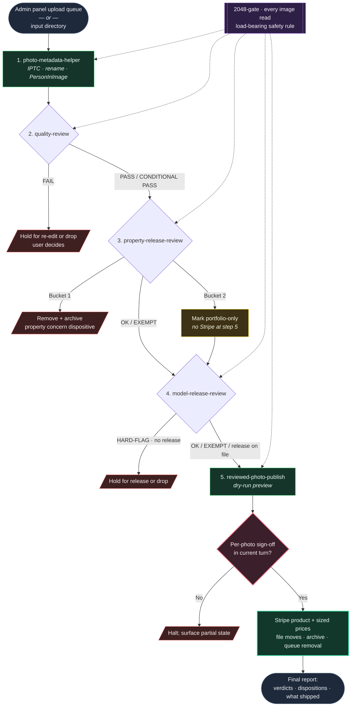

# photography-workflow

A five-step intake pipeline for commercial-photography catalogs, expressed as five self-activating skills. Built for a working photographer running a sales platform: every photo that ends up on a "buy this print" page has been through metadata enrichment, a quality gate, a property/trademark/copyright audit, a model-release audit, and a publish step — in that order, with no step skipped.

## The pipeline

| # | Skill | Question it answers | Output |
|---|-------|---------------------|--------|
| 1 | [`photo-metadata-helper`](skills/photo-metadata-helper/SKILL.md) | What is this photo of, where, and who? | IPTC title / description / keywords / `PersonInImage` embedded; file renamed from a hyphenated title |
| 2 | [`quality-review`](skills/quality-review/SKILL.md) | Is it good enough — technically, editorially, and at print scale? | PASS / CONDITIONAL PASS / FAIL with one-line reasons; size restrictions if any |
| 3 | [`property-release-review`](skills/property-release-review/SKILL.md) | Is anything in the scene a rights concern (building, sculpture, mural, branded venue, trademark)? | Bucket 1 / Bucket 2 / SOFT-FLAG / OK / EXEMPT per image, with FOP analysis where relevant |
| 4 | [`model-release-review`](skills/model-release-review/SKILL.md) | Does anyone in the frame need a signed model release? | HARD-FLAG / SOFT-FLAG / OK / EXEMPT keyed to identifiability-to-the-public, with stricter bars for children and workers-at-workplace |
| 5 | [`reviewed-photo-publish`](skills/reviewed-photo-publish/SKILL.md) | Catalog entry, sales-platform listing, intake-queue cleanup — only acts on photos that cleared every upstream step | Stripe product + child prices per supported size; file moved to published location; original archived; intake queue cleaned |

Each skill's `SKILL.md` declares its position in the pipeline. Order matters: quality runs before legal so rights-clearance effort isn't spent on photos that won't make it; property runs before model because property/trademark concerns are usually dispositive regardless of model status. A FAIL or Bucket-1 at any upstream step short-circuits the rest of the pipeline for that photo.

For audit-only sweeps of an already-published catalog, any single skill can be invoked standalone.

## Diagram


The two red-bordered nodes — the 2048-gate and the per-photo sign-off — are load-bearing safety rules. Everything else can be tuned; those two stay.

## Two rules that show up in every skill

**1. The 2048-gate.** Before reading or classifying any image, downscale to 2048px on the long edge and view the downscaled copy. If the resize fails, HALT and ask — never fall back to the full-resolution original. This block is duplicated in every skill on purpose: it once prevented a session from burning ~137M tokens reading full-res photos, and inlining it is the only way to be sure it survives partial loads, refactors, and skill-level edits. Treat it as load-bearing safety code, not boilerplate.

**2. Calibrated debate, not capitulation.** When the user challenges a flag, re-apply the 2048-gate, state the strongest counter-argument honestly, test it against the relevant standard (identifiability, FOP, trademark), and concede only when the argument is dispositive. The skills are written to push back on bad flags, not to fold under pressure.

## Installation

This repo is packaged as a [Claude Code plugin](https://code.claude.com/docs/en/plugins.md) and is also its own [marketplace](https://code.claude.com/docs/en/plugin-marketplaces.md). Two commands inside Claude Code install all five skills together:

```text
/plugin marketplace add derekslinz/photography-workflow
/plugin install photography-workflow@photography-workflow
```

Then reload so the skills are picked up in the current session:

```text
/reload-plugins
```

## Entry point

After install, the canonical way to run the full pipeline is:

```text
/photo-intake
```

With no argument, the command pulls pending photos from the **admin panel upload queue** — the day-to-day workflow. For ad-hoc batches that didn't come through the admin panel, pass a directory:

```text
/photo-intake <path-to-input-directory>
```

Either form drives all five steps in order — metadata → quality → property → model → publish — with the short-circuit and sign-off rules enforced. The command source is at [`commands/photo-intake.md`](commands/photo-intake.md).

Skills are also namespaced under the plugin name and self-activate on the trigger phrases in each `SKILL.md` description, so they can be invoked individually for audit-only sweeps or single-step work:

- `photography-workflow:photo-metadata-helper`
- `photography-workflow:quality-review`
- `photography-workflow:property-release-review`
- `photography-workflow:model-release-review`
- `photography-workflow:reviewed-photo-publish`

### Manifests

- [`.claude-plugin/plugin.json`](.claude-plugin/plugin.json) — declares this directory as a plugin
- [`.claude-plugin/marketplace.json`](.claude-plugin/marketplace.json) — declares this repo as a marketplace whose only plugin is itself

### Local development

To work on the skills without going through marketplace install, symlink the entries in `skills/` straight into your skill loader (or point Claude Code at the working tree via its local-plugin support).

## External dependencies

- `exiftool` — IPTC/XMP metadata read & write (`brew install exiftool`)
- `ImageMagick` (`magick`) or `sharp` — the 2048 downscale (`brew install imagemagick` for the bash path)
- `curl` — Nominatim reverse-geocoding in `photo-metadata-helper`

The skills assume bash + macOS / Linux. Sales-platform integration (Stripe in the canonical example) is referenced abstractly — adapt the `property-release-review` remediation pipeline to whatever catalog source-of-truth and sales platform you actually run.

## Status

- All five steps are implemented as skills in this repo.
- `reviewed-photo-publish` is the only step that mutates external state (Stripe, archive directory, intake queue). It refuses to publish anything not stamped by every upstream step, dry-runs every sales-platform write by default, and requires explicit per-photo sign-off in the current turn before any live mutation — no batch approvals, no session-level yeses.
- Pipeline ordering is consistent across all five `SKILL.md` files. If you add a sixth step, every existing skill needs its Intake Sequence updated.
